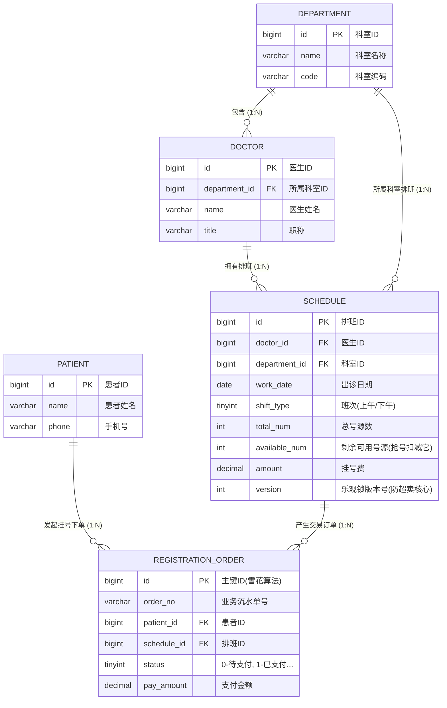

```mermaid
erDiagram
    %% 字典表区
    DEPARTMENT {
        bigint id PK "科室ID"
        varchar name "科室名称"
        varchar code "科室编码"
    }
    DOCTOR {
        bigint id PK "医生ID"
        bigint department_id FK "所属科室ID"
        varchar name "医生姓名"
        varchar title "职称"
    }
    PATIENT {
        bigint id PK "患者ID"
        varchar name "患者姓名"
        varchar phone "手机号"
    }

    %% 核心交易库存区
    SCHEDULE {
        bigint id PK "排班ID"
        bigint doctor_id FK "医生ID"
        bigint department_id FK "科室ID"
        date work_date "出诊日期"
        tinyint shift_type "班次(上午/下午)"
        int total_num "总号源数"
        int available_num "剩余可用号源(抢号扣减它)"
        decimal amount "挂号费"
        int version "乐观锁版本号(防超卖核心)"
    }

    %% 核心交易流水区
    REGISTRATION_ORDER {
        bigint id PK "主键ID(雪花算法)"
        varchar order_no "业务流水单号"
        bigint patient_id FK "患者ID"
        bigint schedule_id FK "排班ID"
        tinyint status "0-待支付, 1-已支付..."
        decimal pay_amount "支付金额"
    }

    %% 关系映射
    DEPARTMENT ||--o{ DOCTOR : "包含 (1:N)"
    DOCTOR ||--o{ SCHEDULE : "拥有排班 (1:N)"
    DEPARTMENT ||--o{ SCHEDULE : "所属科室排班 (1:N)"
    PATIENT ||--o{ REGISTRATION_ORDER : "发起挂号下单 (1:N)"
    SCHEDULE ||--o{ REGISTRATION_ORDER : "产生交易订单 (1:N)"
```